# Binary Ninja 插件从零教学：修复注释中 `0x` 重叠显示（完整教程）

> **文档目标**：让零基础读者 **按顺序动手**，最终能 **独立写出** 与 `hex_comment_fix.py` 同思路的插件，并理解每一步在做什么。  
> **参考**：仓库根目录下的 `hex_comment_fix.py`（与 `doc/` 同级）；Binary Ninja 安装目录内 Python API：`C:\Program Files\Vector35\BinaryNinja\python\binaryninja\`（macOS/Linux 路径不同，下文统称「BN 的 `python/binaryninja`」）。

---

## 0. 教程路线图（你要按什么顺序学）

下面用 **思维导图** 概括全文结构：建议 **从上到下、从左到右** 依次完成。

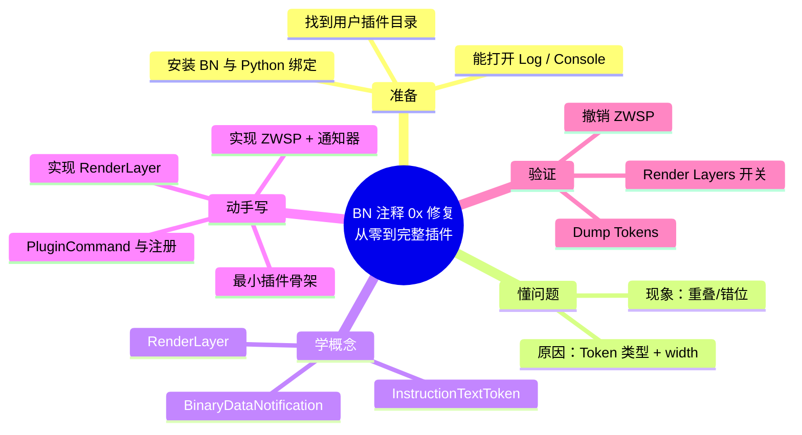

**学习阶段（分天路线）**：把「从零到能自己写」拆成可勾选的小阶段。（`journey` 需较新 Mermaid，此处用 `flowchart` 以兼容旧预览器。）

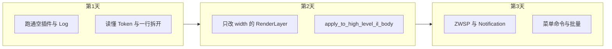

---

## 1. 你需要的前置条件（别跳过）

| 项目 | 最低要求 | 说明 |
|------|----------|------|
| Binary Ninja | 已安装可打开 | 商业版/个人版均可，需能加载 Python 插件。 |
| Python 基础 | 会写函数、类、`import` | 插件用 BN 自带的 Python 环境，不要求你先装系统 Python。 |
| 正则 | 会读简单 `re` | 本例用一行正则插入零宽字符。 |
| 耐心 | 会查 BN 安装目录里的 `.py` | API 以 **源码里的 docstring** 为准，比死记网页更可靠。 |

**本教程不假设**你会 C++、会逆向，只要会 **按步骤改 `.py` 文件并重启/重载 BN**。

---

## 2. 问题是什么：先建立「画面」

### 2.1 现象

在 **反汇编 / IL 视图** 的行尾注释里写 `0xdeadbeef` 之类，有时 **注释后半段与前面叠在一起**，或 **中文注释** 时更容易错位。

### 2.2 根因（必须理解，后面代码才有意义）

Binary Ninja 把 **一行显示** 拆成多个 **`InstructionTextToken`**（指令片段、寄存器、**注释片段**等）。官方在 `architecture.py` 里说明：每种 `InstructionTextTokenType` 对应一类显示语义。

**问题一：注释里的 `0x...` 被误当成「整数/疑似地址」**

核心可能把注释中的十六进制样式识别为：

- `IntegerToken`
- `PossibleAddressToken`（「像地址」的整数）

它们与 **`CommentToken`** 的 **绘制规则、列宽计算** 往往不一致。同一段注释被切成多种 token，就容易 **后续 token 起始列算错 → 重叠**。

**问题二：`width` 与 CJK**

`InstructionTextToken` 有 **`width`** 字段，表示等宽字体下占多少 **列**。Python 绑定里若 `width == 0`，会用 `len(text)`（见 `InstructionTextToken.__post_init__`）。  
**东亚宽字符**在界面里常占 **2 列**，但 `len("字")==1`，少算列宽就会 **把后面的字「拉」到错误位置**。

下面 **放射状（中心向外）** 概括根因（便于记忆）：

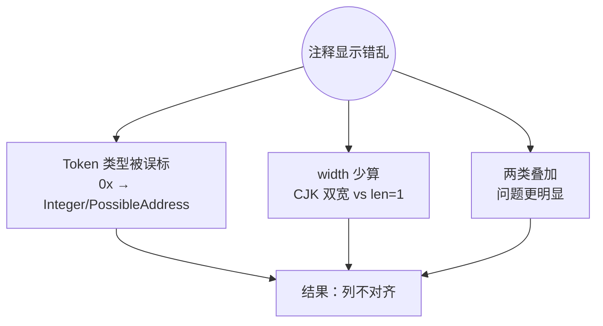

---

## 3. 解决思路总览：两道防线（先背结构，再写代码）

**防线 1（改数据库里的注释字符串）**：在 `0` 与 `x` 之间插入 **零宽空格 U+200B（ZWSP）**，从字符串层面打断 `0x` 连续模式，让核心 **少把注释当成十六进制 token**。  
**防线 2（改显示前的 token 列表）**：用 **`RenderLayer`** 在 UI 绘制前，把注释区里误标的 token **改回 `CommentToken`**，并 **修正 `width`**。

**「放射」总览图**（中心是目标，四周是手段；与下面左右流程图互补）：

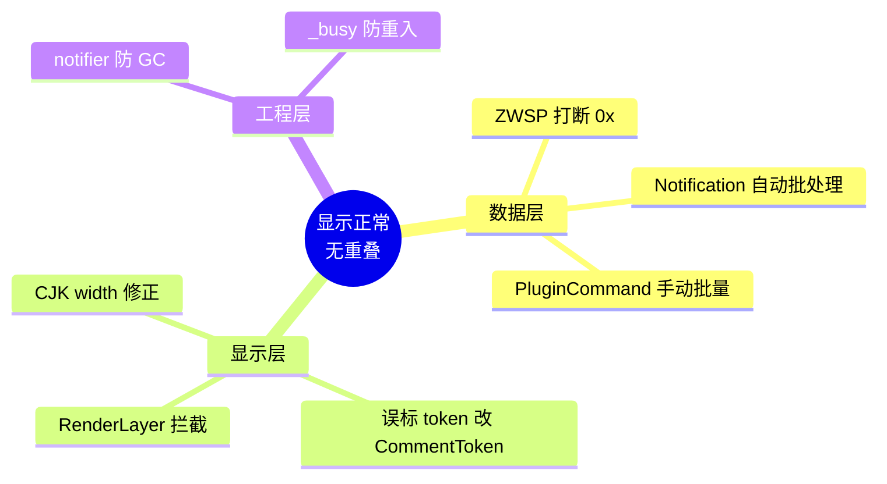

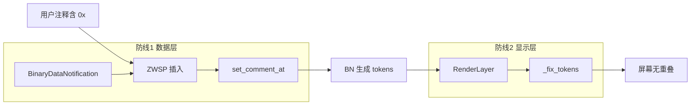

**教学顺序 vs 效果（象限意）**：横轴「实现难度」、纵轴「对重叠问题的覆盖」。  
说明：`quadrantChart` 仅在 **Mermaid 10.3+** 可用；**Markdown Preview Mermaid Support** 等插件常内置旧版 Mermaid，会报 `Lexical error`。下面改用 **`flowchart` 模拟四象限**（兼容 8.x / 9.x）。

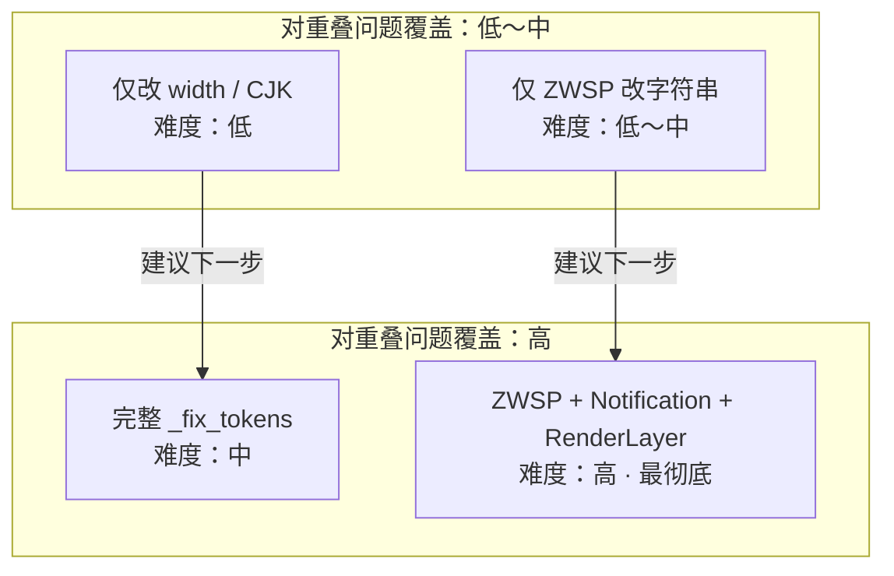

| 模块 | 实现难度（粗分） | 覆盖效果（粗分） |
|------|------------------|------------------|
| 仅 `_display_width` / 校正 CommentToken `width` | 低 | 低（主要缓解 CJK） |
| 完整 `_fix_tokens`（含误标 token 改回） | 中 | 高 |
| 仅 ZWSP 改存储字符串 | 低～中 | 中（打断 `0x` 识别） |
| ZWSP + `BinaryDataNotification` + `RenderLayer` | 高 | 最高 |

**记忆口诀**：先 **`RenderLayer` + `_fix_tokens`**（见效快），再补 **ZWSP 与通知器**（更彻底）。

---

## 4. 环境准备：插件放哪、如何被加载

### 4.1 用户插件目录（你要先找到）

Binary Ninja 会从 **用户插件目录** 加载 `*.py`。常见位置（以官方习惯为准，若版本不同请以 **Help → Open Plugin Folder** 或设置为准）：

- **Windows**：`%APPDATA%\Binary Ninja\plugins\`（或文档所述用户数据目录下的 `plugins`）
- **macOS**：`~/Library/Application Support/Binary Ninja/plugins/`
- **Linux**：`~/.local/share/binaryninja/plugins/`（以实际为准）

**实操步骤**：

1. 打开 Binary Ninja。  
2. 若菜单有 **Open Plugin Folder**，直接打开；否则按上表手动建 `plugins` 文件夹。  
3. 新建文件 `hex_comment_fix.py`（可先放空文件测试）。  
4. **完全退出并重启** BN（首次加载插件建议重启）。

### 4.2 验证 Python 能 `import binaryninja`

在 BN 的 **Python 控制台**（若有）或写一个 **最小插件**：

```python
from binaryninja import log_info
log_info("hello from plugin")
```

若 Log 里能看到输出，说明 **环境 OK**。

---

## 5. 核心 API 速查（写代码时对照）

| 概念 | 类/函数 | 作用（与本教程关系） |
|------|---------|----------------------|
| 显示管线钩子 | `RenderLayer` | 在界面展示前修改 **行 / token**。见 `renderlayer.py` 类文档。 |
| 块级统一入口 | `apply_to_block` | 图视图里一个 Basic Block 的一串 `DisassemblyTextLine`。 |
| HLIL 线性特例 | `apply_to_high_level_il_body` | 线性视图里 HLIL 函数体 **没有 block**，token 在 `line.contents.tokens`。 |
| 数据变更监听 | `BinaryDataNotification` | 注释变更会触发元数据/函数更新；在回调里 **改写注释**。见 `binaryview.py`。 |
| 注册监听 | `BinaryView.register_notification` | 把通知器绑到当前 `bv`。 |
| 菜单命令 | `PluginCommand.register` | 挂到 **Plugins** 菜单，执行批量修复、调试。 |
| Token 类型 | `InstructionTextTokenType` | `CommentToken`、`PossibleAddressToken`、`IntegerToken` 等，见 `enums.py`。 |

**BN 内部渲染层如何走到你的代码**（简化序列图）：

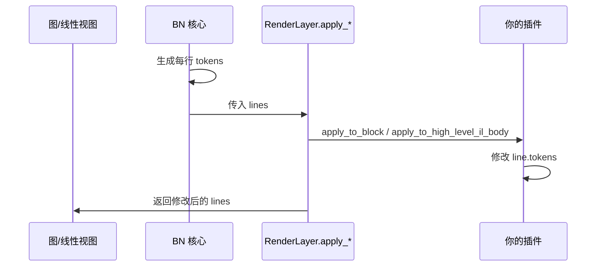

**从「打开二进制」到「像素」的多层管道**（帮助建立全局观；你的插件插在 **RenderLayer** 这一环）：

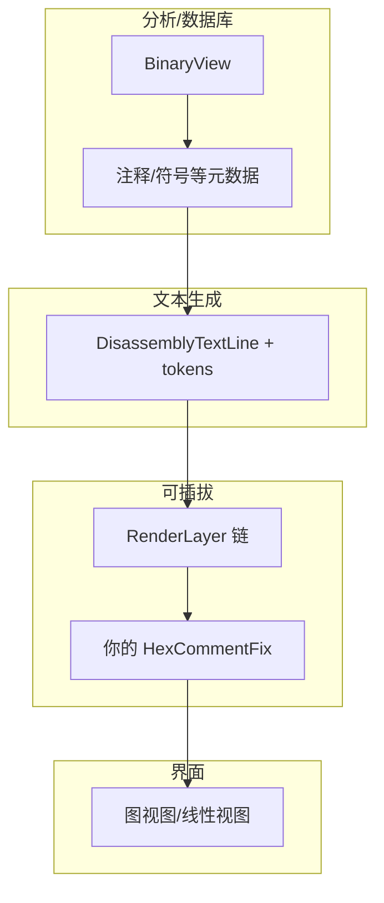

**注释被编辑时的数据路径**（防线 1 为何用通知）：

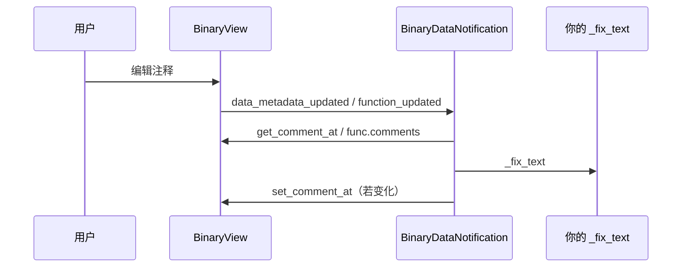

---

## 6. 分步实现：从零到完整（按顺序抄改）

下面每一步都可以 **单独保存为可运行版本**，再叠加下一步。

### 阶段 A：空壳插件 + `RenderLayer.register()`

**目标**：BN 启动时加载插件，**注册一个 RenderLayer**，在 Log 里打印一行。

你需要：

1. 定义类 `class MyLayer(RenderLayer):`，设置 `name`（必填）、`default_enable_state`。  
2. 类末尾调用 `MyLayer.register()`。  
3. 暂时 **不重写** `apply_to_*`，确认不报错即可。

**检查**：**View → Render Layers** 里是否出现你的层名（若默认关闭，手动勾选）。

### 阶段 B：实现 `_display_width`（CJK 列宽）

**教学要点**：东亚字符用 `unicodedata.east_asian_width(ch)`，`W`/`F` 计 **2**，其余 **1**。

**自测**：在 Python 里断言 `_display_width("中文") == 4`（两字各 2 列）。

### 阶段 C：实现 `_fix_tokens`（显示层核心）

**教学要点**（与 `hex_comment_fix.py` 一致）：

1. 维护 `in_comment`：在 **本行** token 列表里，**一旦出现第一个 `CommentToken`**，认为进入注释区（通常为 `;` 那一段）。  
2. 对每个 **`CommentToken`**：若 `_display_width(text) != tok.width`，用 **`InstructionTextToken` 构造新 token**（插件里用 `_clone_token` 复制其它字段，只改 `width`）。  
3. 在 `in_comment` 为真时，若遇到 `IntegerToken` / `PossibleAddressToken` / `FloatingPointToken`，**改成 `CommentToken`**，`PossibleAddressToken` 可用 `hex(tok.value)` 恢复字面量（见原插件异常处理）。

**状态机（与实现对齐）**：

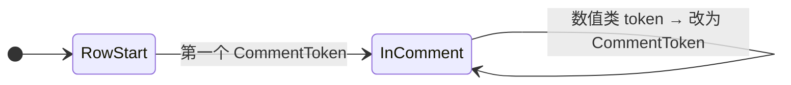

**为何不能从行首就改整数 token？**  
指令里的立即数也是 `IntegerToken`；只有 **第一个 `CommentToken` 之后** 的数值类才可能是「注释里的假 0x」。

### 阶段 D：挂到 `apply_to_block` 与 `apply_to_high_level_il_body`

**教学要点**：

- **图视图 / 带 block 的线性反汇编**：重写 `apply_to_block`，遍历 `lines`，改 `line.tokens`。  
- **线性视图 HLIL 函数体**：重写 `apply_to_high_level_il_body`，遍历 `lines`，改 **`line.contents.tokens`**（结构不同，易漏）。

**对比表**：

| 入口 | 改哪里 |
|------|--------|
| `apply_to_block` | `line.tokens` |
| `apply_to_high_level_il_body` | `line.contents.tokens` |

### 阶段 E：ZWSP 与 `_fix_text` / `_unfix_text`

**教学要点**：

- `ZWSP = '\u200b'`。  
- 正则：`r'0([xX][0-9a-fA-F])'`，替换为 `'0' + ZWSP + m.group(1)`。  
- **幂等**：若字符串里已有 ZWSP，直接返回，避免重复插入。  
- **撤销**：`text.replace(ZWSP, '')`。

### 阶段 F：`BinaryDataNotification` + `_busy`

**教学要点**：

- 实现 `data_metadata_updated(self, view, offset)`：读 `view.get_comment_at(offset)`，写回修复后的文本。  
- 实现 `function_updated(self, view, func)`：遍历 `func.comments`。  
- **`_busy` 标志**：在 `set_comment_at` 前设 True，避免 **回调里再次触发回调** 导致递归或死循环（原插件做法）。

### 阶段 G：`PluginCommand` 批量 + 注册通知器

**教学要点**：

1. 遍历 `bv.address_comments` 与每个 `func.comments`，批量 `_fix_text`。  
2. `notifier = YourNotifier(); bv.register_notification(notifier)`。  
3. **把 notifier 存进全局列表**（如 `_active_notifiers.append(notifier)`），防止被 **垃圾回收** 导致监听失效。

### 阶段 H：调试命令

遍历 `func.get_disassembly_text()`，对含 `CommentToken` 的行 `log_info` 打印每个 token 的 `type`、`text`、`width`、`value`。

---

## 6.1 实现时间线（可与「阶段 A～H」对照）

（`timeline` 需较新 Mermaid，此处用纵向 `flowchart` 表示先后顺序。）

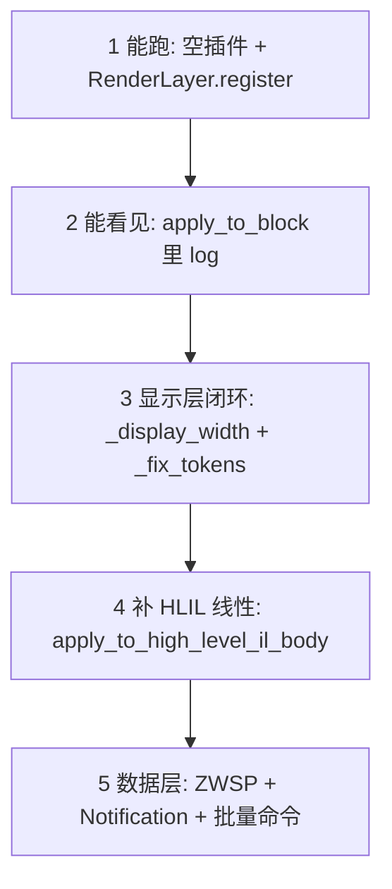

---

## 7. 完整架构图（类与数据流）

**对照 `hex_comment_fix.py` 源文件结构的思维导图**（写代码时按块抄）：

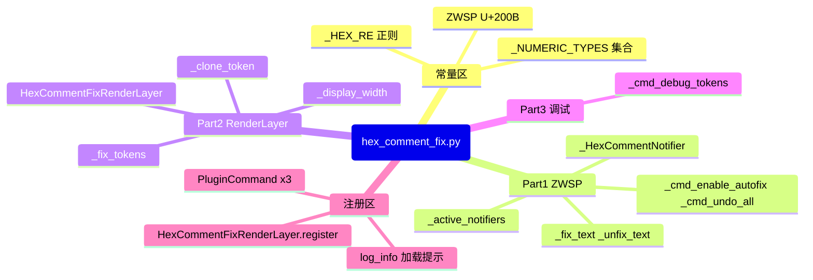

**类关系（简化）**：

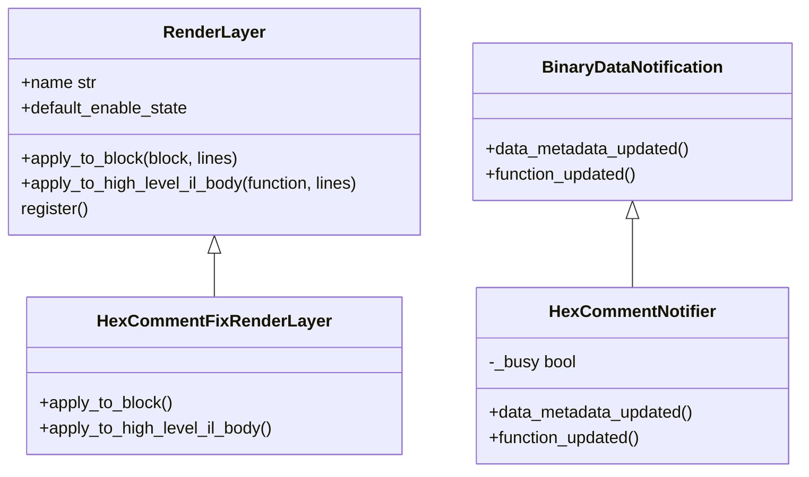

**插件内部函数依赖（自下而上读）**：

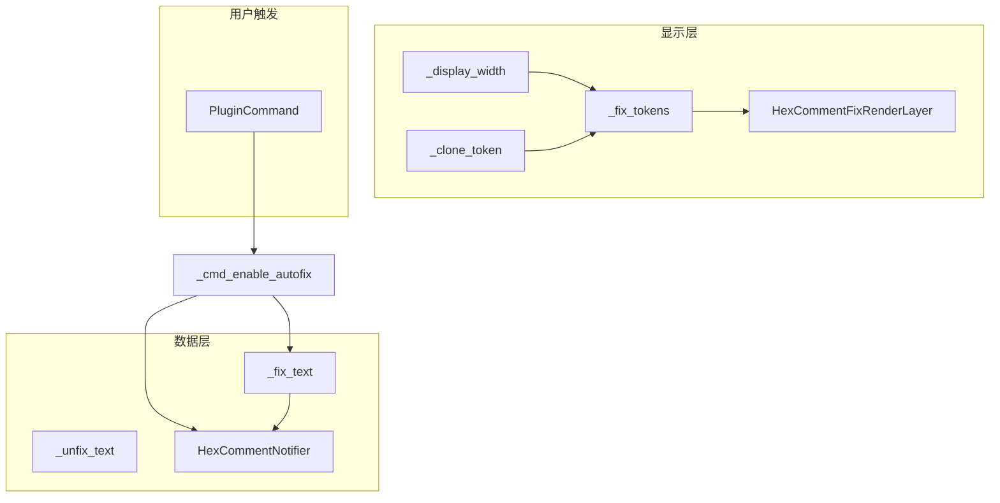

---

## 8. 「放射」知识结构：遇到问题查哪一层

把 **症状 → 该查的防线** 画成多叉图，方便你以后自己改：

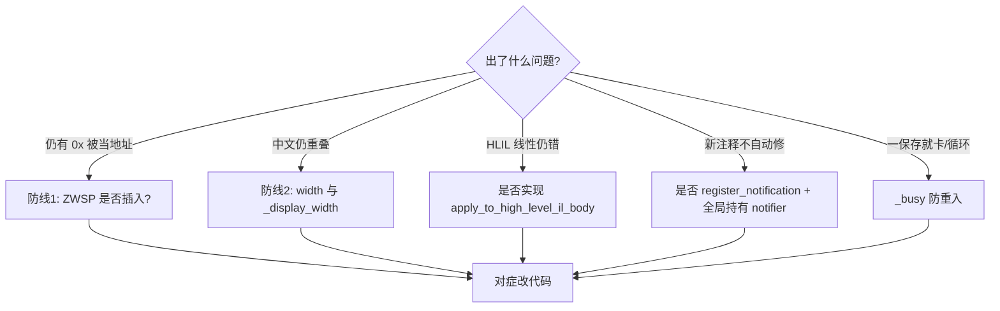

---

## 9. 自检清单（写完以为自己会了，用这个验证）

打印或复制下表，逐项打勾：

- [ ] 插件文件在用户 `plugins` 目录，重启后 **无加载错误**。  
- [ ] **View → Render Layers** 能看到 **Hex Comment Fix**（或你的层名），勾选后问题有改善。  
- [ ] 执行 **Enable Auto-Fix** 后，**地址注释 + 函数注释** 都被处理（可抽样用十六进制注释测试）。  
- [ ] 新加一条含 `0x` 的注释，**保存后**自动插入 ZWSP（可用 **Undo All Fixes** 验证能去掉）。  
- [ ] **Debug: Dump Tokens** 能在 Log 里看到 `PossibleAddressToken` / `CommentToken` 与 `width`。  
- [ ] 读过 `renderlayer.py` 里 `apply_to_linear_view_object` 如何调用 `apply_to_high_level_il_body`，能向别人解释 **为何 HLIL 线性要单独写**。

---

## 10. 常见坑（教程必写，省你几小时）

| 坑 | 现象 | 处理 |
|----|------|------|
| 通知器被 GC | 批量修一次后，新注释不自动修 | 全局列表保存 notifier 引用 |
| 回调递归 | 卡死、CPU 飙 | `_busy` 或等价标志 |
| 只改 `apply_to_block` | HLIL 线性仍重叠 | 实现 `apply_to_high_level_il_body` |
| 误改指令里的整数 | 指令操作数显示异常 | **仅在第一个 CommentToken 之后** 转换数值类 token |
| 找不到插件目录 | 插件不加载 | 用 BN 菜单 **Open Plugin Folder** |

---

## 11. 与官方源码对照（自学路径）

在 BN 安装目录打开（路径随安装位置变化）：

| 文件 | 读什么 |
|------|--------|
| `python/binaryninja/renderlayer.py` | `RenderLayer` 文档字符串、`apply_to_block` 默认如何分发到 IL |
| `python/binaryninja/binaryview.py` | `BinaryDataNotification` 各回调含义、`register_notification` |
| `python/binaryninja/architecture.py` | `InstructionTextToken` 字段与 `width` 默认 |
| `python/binaryninja/enums.py` | `InstructionTextTokenType` 枚举值 |

---

## 12. 小结：你学完应能复述的三句话

1. **重叠** 来自 **注释被拆成多种 token** 与 **`width` 少算 CJK 列宽** 两件事。  
2. **ZWSP** 从 **存储的字符串** 上打断 `0x`；**RenderLayer** 从 **显示前的 token** 上兜底并校正宽度。  
3. **监听** 用 `BinaryDataNotification`，**菜单** 用 `PluginCommand`，**两者都要注册**，且注意 ** notifier 生命周期与重入**。

---

## 13. 附录：参考路径

| 内容 | 路径 |
|------|------|
| 本仓库完整实现 | 仓库根目录 `hex_comment_fix.py` |
| BN `RenderLayer` | `...\BinaryNinja\python\binaryninja\renderlayer.py` |
| BN `BinaryDataNotification` | `...\BinaryNinja\python\binaryninja\binaryview.py` |
| BN `InstructionTextToken` | `...\BinaryNinja\python\binaryninja\architecture.py` |
| BN `InstructionTextTokenType` | `...\BinaryNinja\python\binaryninja\enums.py` |

---

*若未来 Binary Ninja 调整注释分词或 `width` 语义，以实际 Log 与 token 转储为准；本教程侧重 **可复现的实现步骤** 与 **概念结构**，与具体版本细节以官方更新为准。*
