# Binary Ninja MCP Server 开发计划

**文档版本：** v1.0  
**日期：** 2026-03-23  
**参考文档：** `002-bn-mcp-server-需求文档.md`  
**开发周期：** 7 周（4 个阶段）

---

## 一、总体开发时间线

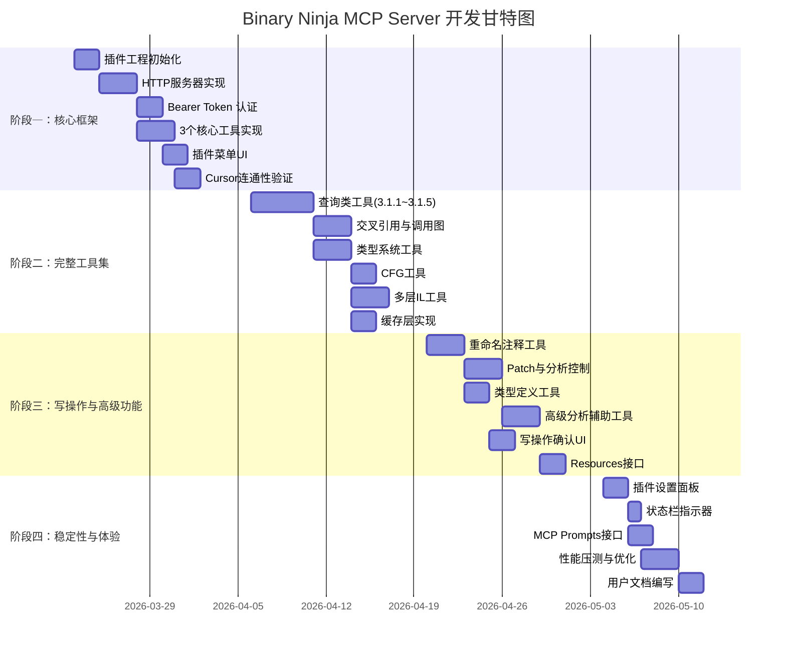

---

## 二、整体系统架构图

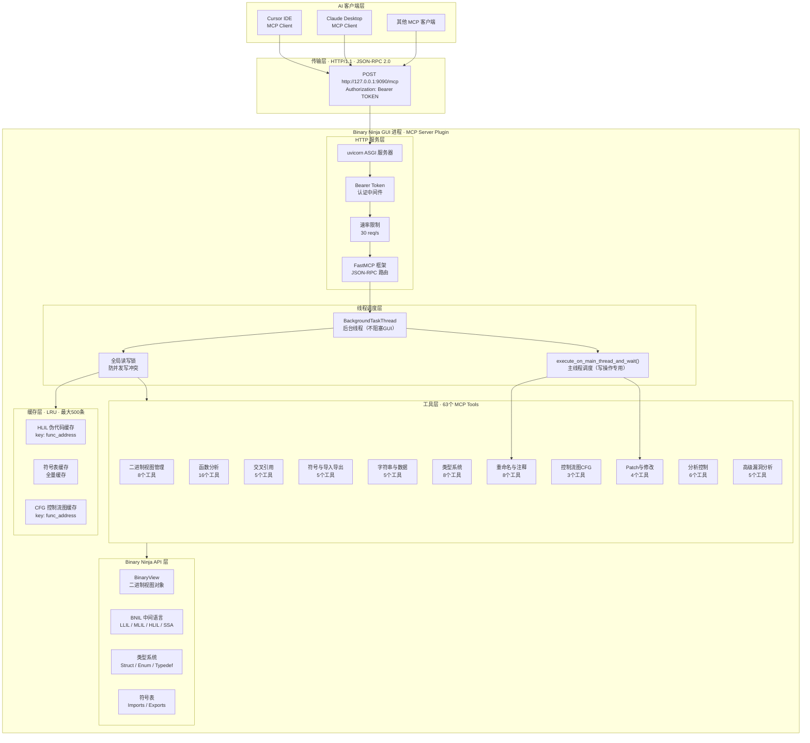

---

## 三、模块依赖关系图

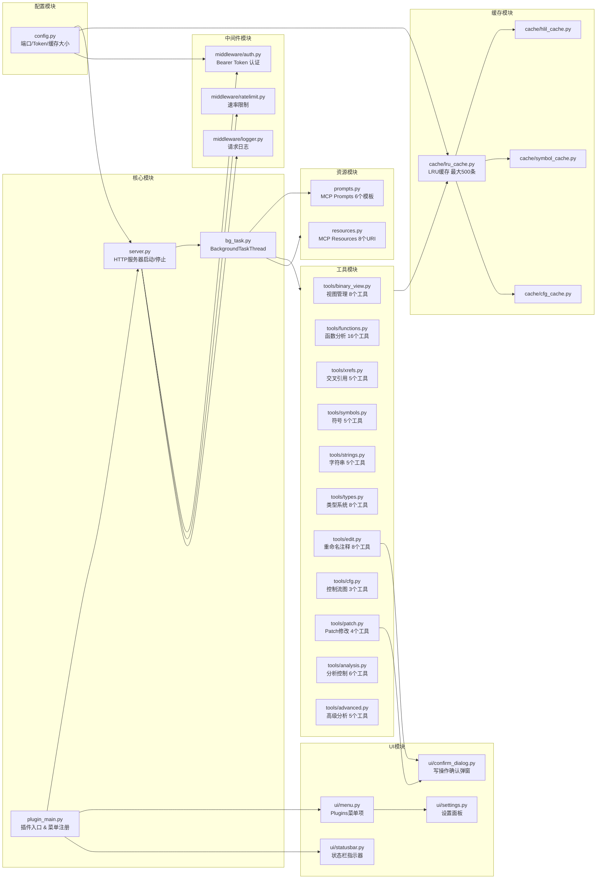

---

## 四、阶段一详细开发流程

### 4.1 阶段一总览

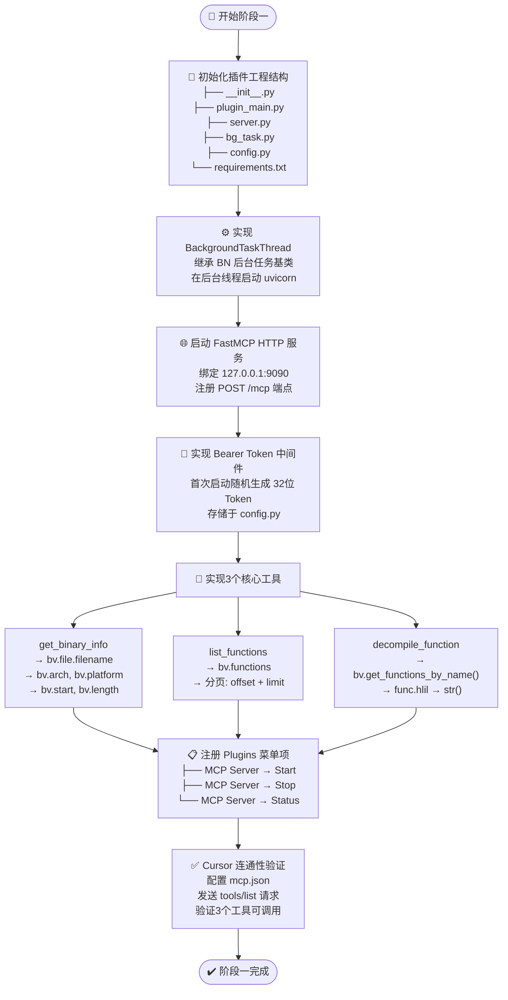

### 4.2 工程目录结构

```
bn-mcp-server/
├── __init__.py                  # BN 插件入口，注册菜单
├── plugin_main.py               # 插件生命周期管理
├── server.py                    # HTTP 服务器核心
├── bg_task.py                   # BackgroundTaskThread 封装
├── config.py                    # 全局配置（端口/Token/缓存）
├── requirements.txt             # Python 依赖
├── middleware/
│   ├── auth.py                  # Bearer Token 认证
│   ├── ratelimit.py             # 速率限制（30 req/s）
│   └── logger.py                # 请求日志
├── tools/
│   ├── binary_view.py           # 视图管理（8个工具）
│   ├── functions.py             # 函数分析（16个工具）
│   ├── xrefs.py                 # 交叉引用（5个工具）
│   ├── symbols.py               # 符号（5个工具）
│   ├── strings.py               # 字符串（5个工具）
│   ├── types.py                 # 类型系统（8个工具）
│   ├── edit.py                  # 重命名注释（8个工具）
│   ├── cfg.py                   # 控制流图（3个工具）
│   ├── patch.py                 # Patch修改（4个工具）
│   ├── analysis.py              # 分析控制（6个工具）
│   └── advanced.py              # 高级漏洞分析（5个工具）
├── cache/
│   ├── lru_cache.py             # LRU 缓存基类
│   ├── hlil_cache.py            # HLIL 伪代码缓存
│   ├── symbol_cache.py          # 符号表缓存
│   └── cfg_cache.py             # CFG 缓存
├── resources.py                 # MCP Resources（8个URI）
├── prompts.py                   # MCP Prompts（6个模板）
└── ui/
    ├── menu.py                  # Plugins菜单
    ├── settings.py              # 设置面板
    ├── statusbar.py             # 状态栏指示器
    └── confirm_dialog.py        # 写操作确认弹窗
```

---

## 五、阶段二详细开发流程

### 5.1 工具集实现顺序

```mermaid
flowchart LR
    Start([🚀 开始阶段二]) --> G1

    subgraph G1["第1优先级·只读查询工具"]
        direction TB
        T11["tools/binary_view.py
        get_segments
        get_sections
        read_memory
        get_entry_points
        list_binary_views
        switch_binary_view"]

        T12["tools/functions.py
        get_function_by_address
        get_function_by_name
        get_function_assembly
        get_function_variables
        get_function_parameters
        get_function_return_type
        get_function_tags
        get_function_complexity
        get_function_callees
        get_function_callers"]

        T13["tools/symbols.py
        list_symbols
        get_symbol_at
        list_imports
        list_exports
        find_symbol_by_name"]

        T14["tools/strings.py
        list_strings
        search_string
        get_data_at
        list_data_variables
        search_bytes"]
    end

    G1 --> G2

    subgraph G2["第2优先级·IL多层分析"]
        direction TB
        IL1["tools/functions.py (续)
        get_function_llil
        get_function_mlil
        get_function_hlil
        get_function_ssa"]

        IL2["tools/xrefs.py
        get_code_xrefs_to
        get_code_xrefs_from
        get_data_xrefs_to
        get_data_xrefs_from
        get_call_graph"]

        IL3["tools/cfg.py
        get_basic_blocks
        get_cfg
        get_dominators"]
    end

    G2 --> G3

    subgraph G3["第3优先级·类型系统 & 缓存"]
        direction TB
        TP1["tools/types.py
        list_types
        get_type"]

        CA["cache/lru_cache.py
        cache/hlil_cache.py
        cache/symbol_cache.py
        cache/cfg_cache.py"]
    end

    G3 --> End2([✔️ 阶段二完成])
```

### 5.2 BNIL 多层中间语言获取流程

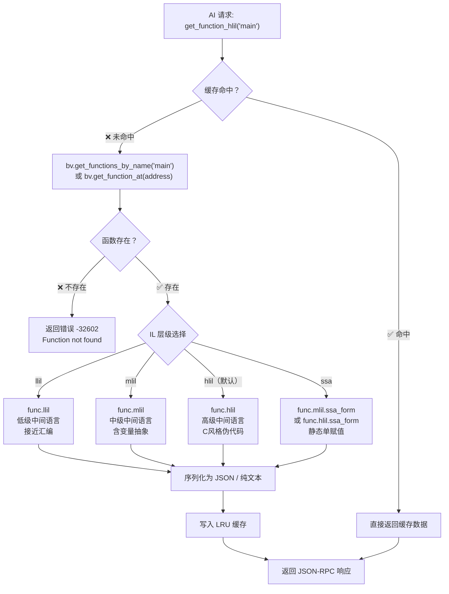

---

## 六、阶段三详细开发流程

### 6.1 写操作安全调度流程

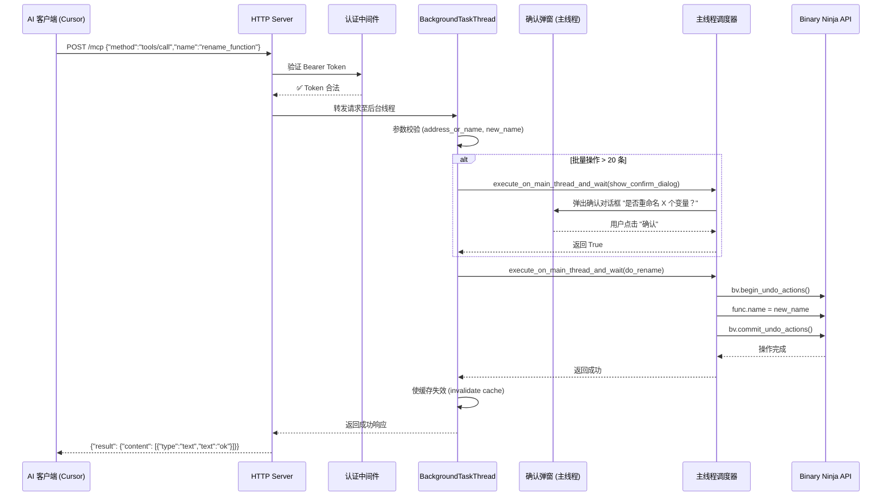

### 6.2 Patch 操作完整流程

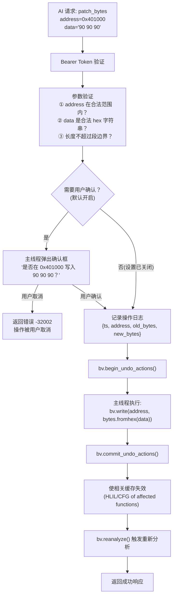

### 6.3 MCP Resources 数据流

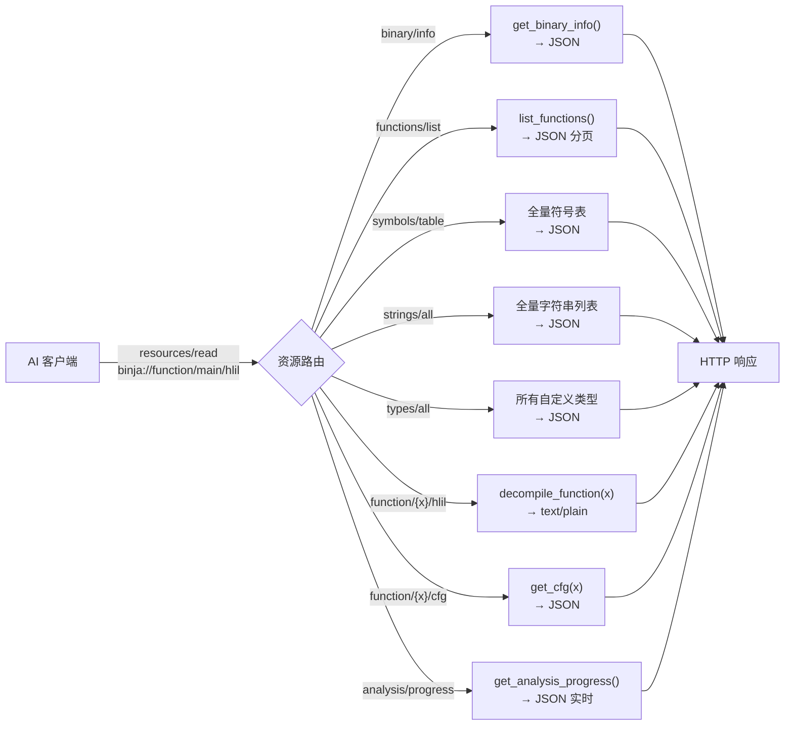

---

## 七、阶段四详细开发流程

### 7.1 插件 UI 完整结构

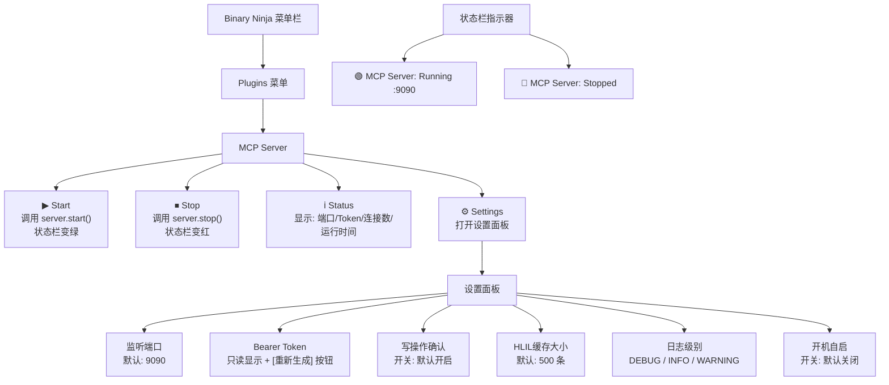

### 7.2 性能优化策略

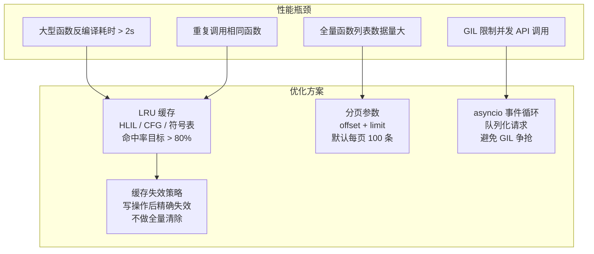

---

## 八、核心数据流转图

### 8.1 完整 HTTP 请求处理链路

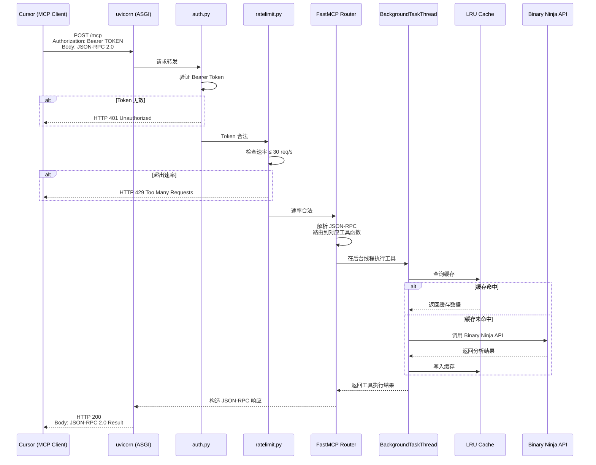

### 8.2 缓存失效机制

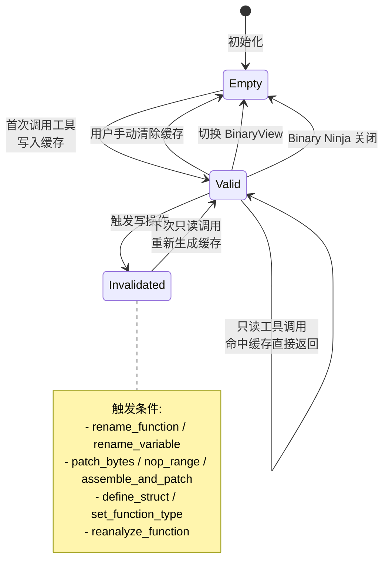

---

## 九、工具分类与实现优先级矩阵

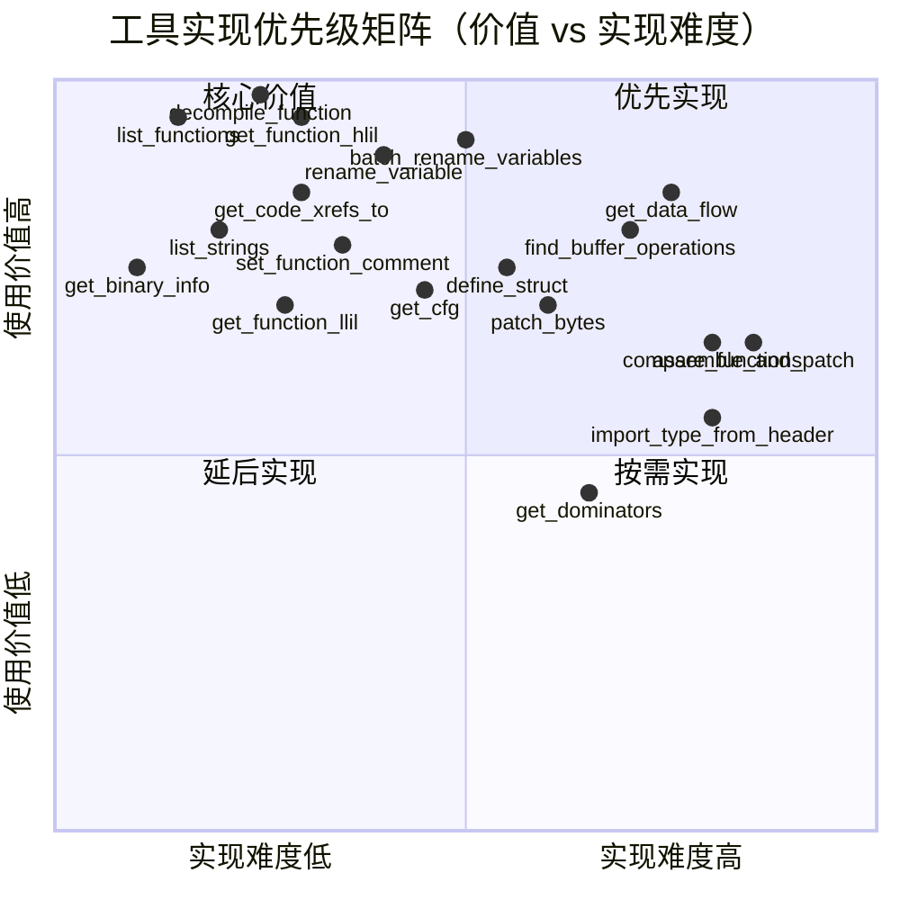

---

## 十、各阶段交付物与验收标准

### 10.1 阶段一验收标准

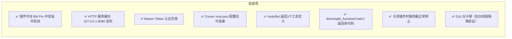

### 10.2 阶段二验收标准

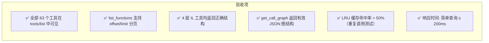

### 10.3 阶段三验收标准

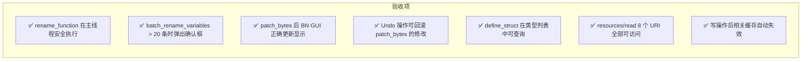

### 10.4 阶段四验收标准

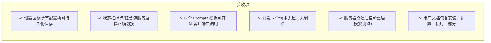

---

## 十一、风险应对计划

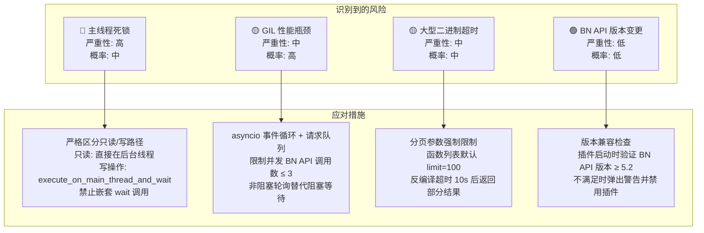

---

## 十二、技术依赖安装与环境准备

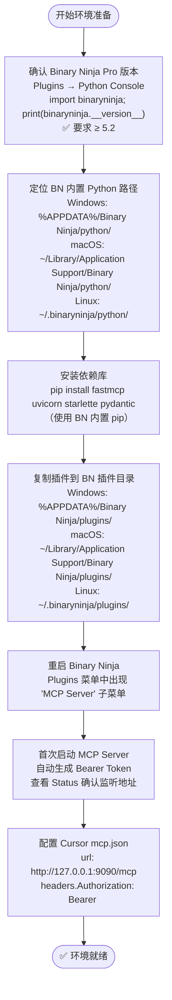

---

## 十三、开发里程碑汇总

| 里程碑 | 目标日期 | 核心交付物 | 验收关键指标 |
|:---|:---|:---|:---|
| **M1** 框架 MVP | Week 2 末 | HTTP 服务器 + 认证 + 3个核心工具 | Cursor 可成功调用 decompile_function |
| **M2** 完整工具集 | Week 4 末 | 全部 63 个只读工具 + 缓存层 | tools/list 返回 63 个工具，查询响应 ≤ 200ms |
| **M3** 写操作就绪 | Week 6 末 | 写操作工具 + Patch + 类型系统 + Resources | rename + patch 可正常执行并支持 Undo |
| **M4** 正式发布 | Week 7 末 | 完整 UI + Prompts + 文档 + 稳定性优化 | 全部验收标准通过，文档完整 |

---

*文档结束*
